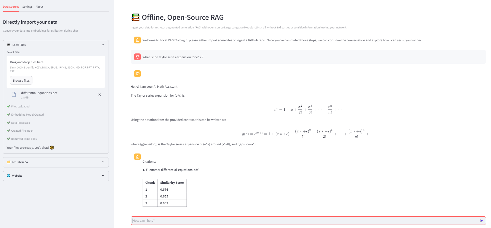

# Math RAG implementation :

This application is specifically fine-tuned to handle math-related questions. Users can ask math-related questions from the documents, and the bot is designed to understand and process math expressions, providing accurate answers.

### Key Features

- **Math Expression Understanding**: The user can ask mathematical questions in natural langauge and Latex notations.
- **Vector index**: Documents loaded will be processed as text and embeddings save in vectorindex stored in folder vector_db
- **Document-Based Question Answering**: Users can ask questions based on the content of the ingested documents.
- **Math Solutions**: The bot provides provides solutions to math problems, leveraging its understanding of mathematical concepts from the documents in a step by step manner
- **Ground Truth**: The app also shares the document names and vector similarity score with the retrieved chunks. 
- **Latex based formattting**: The LLM is instructed to generate resppnse in LateX notation which is rendered in UI.

### Math Focussed Enhancements : 

- Fine tuned the prompt utilizing chain of though and few shot prompting to guide the chatbot to generate a maths focussed response. 
- Handles hullucinations by checking similarity scores of documents with the threshold . The chatbot is allowed to use its math knowledge to answer but a cautionary message is addded to check for answers .
- Post processsing of LLM response to convert math equations in LaTex equations which are rendered in streamlit app. 

## Limitations : 
- Streaming of response not supported yet
- Uploading new documents to an already running Streamlit app is not supported; you need to restart the app to add new documents.

## Usage

1. **Ingest Documents**: Upload your math-related documents to the application.
2. **Ask Questions**: Use the chat interface to ask math-related questions.
3. **Get Answers**: Receive accurate answers with properly formatted math expressions.

Setup and usage instructions : 

- [Setup & Deploy the App](docs/setup.md)
- [Using Local RAG](docs/usage.md)
- [RAG Pipeline](docs/pipeline.md)
- [API Endoints](docs/apiendpoint.md)

Troubleshooting : 
- [Troubleshooting](docs/troubleshooting.md)
- [Documents](docs/resources.md)